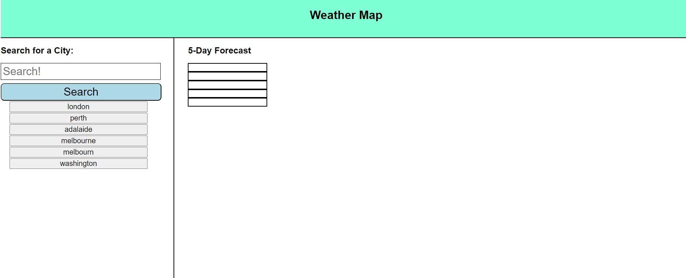
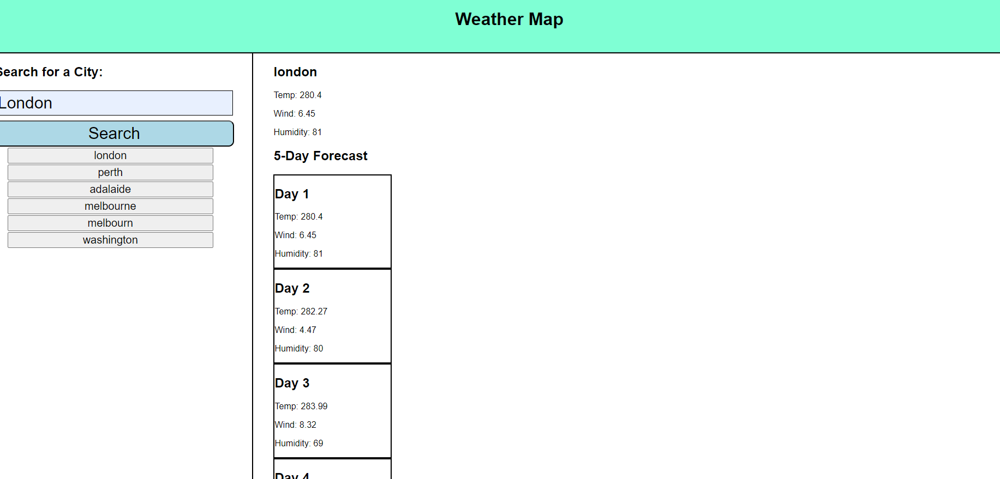
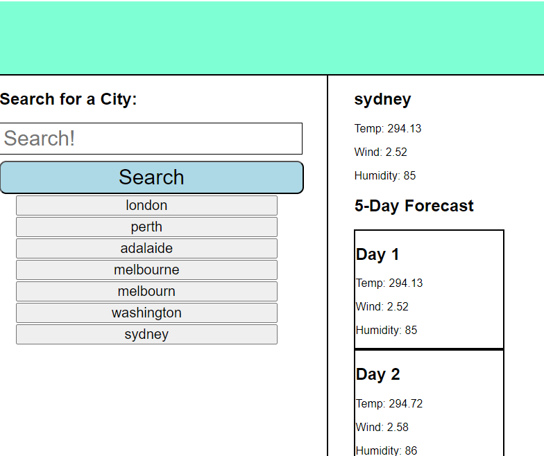

# Weather-Map
## Description
In this homework we where tasked to make a weather page where people can look up cities and see what the weather will be like for today 
and the next 5 days. The city gives three weather descriptions for the day Temperature(Temp), Wind and Humidity and once a new city has 
been searched the location will be added to the side as a button for a quicker way to look up ther weather.

## User Story
```
AS A traveler
I WANT to see the weather outlook for multiple cities
SO THAT I can plan a trip accordingly
```

## Acceptance Criteria
```
GIVEN a weather dashboard with form inputs
WHEN I search for a city
THEN I am presented with current and future conditions for that city and that city is added to the search history
WHEN I view current weather conditions for that city
THEN I am presented with the city name, the date, an icon representation of weather conditions, the temperature, the humidity, and the wind speed
WHEN I view future weather conditions for that city
THEN I am presented with a 5-day forecast that displays the date, an icon representation of weather conditions, the temperature, the wind speed, and the humidity
WHEN I click on a city in the search history
THEN I am again presented with current and future conditions for that city
```

## Images
Screenshots of webpage.




## Links
Website: [Link text](https://christopher-va.github.io/Weather-Map/)
Github: [Link text](https://github.com/Christopher-VA/Weather-Map)